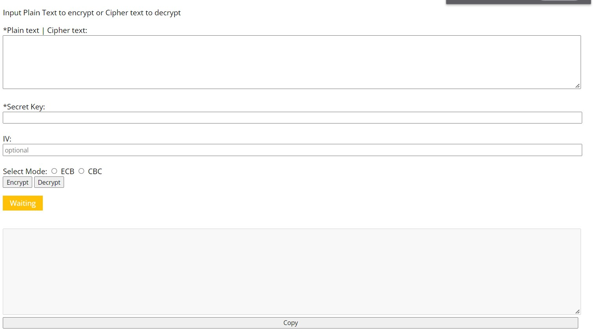

[![Contributors][contributors-shield]][contributors-url]
[![Forks][forks-shield]][forks-url]
[![Tags][tags-shield]][tags-url]
[![Issues][issues-shield]][issues-url]
[![MIT License][license-shield]][license-url]
[![LinkedIn][linkedin-shield]][linkedin-url]

<h1>AES JS Cryptool</h1>

 

<h3><i>JS AES and RSA Cryptool using cryptjs library</i></h3>
 
<h4>Mathias Brunkow Moser</h4>
 

> ## Main UI
 

 

<!-- MARKDOWN LINKS & IMAGES -->
<!-- https://www.markdownguide.org/basic-syntax/#reference-style-links -->
[contributors-shield]: https://img.shields.io/github/contributors/matbmoser/aes-js-cryptool.svg?style=for-the-badge
[contributors-url]: https://github.com/matbmoser/aes-js-cryptool/graphs/contributors
[forks-shield]: https://img.shields.io/github/forks/matbmoser/aes-js-cryptool.svg?style=for-the-badge
[forks-url]: https://github.com/matbmoser/aes-js-cryptool/network/members
[tags-shield]: https://img.shields.io/github/v/tag/matbmoser/aes-js-cryptool.svg?sort=semver&style=for-the-badge
[tags-url]: https://github.com/matbmoser/aes-js-cryptool/tags
[issues-shield]: https://img.shields.io/github/issues/matbmoser/aes-js-cryptool.svg?style=for-the-badge
[issues-url]: https://github.com/matbmoser/aes-js-cryptool/issues
[license-shield]: https://img.shields.io/github/license/matbmoser/aes-js-cryptool.svg?style=for-the-badge
[license-url]: https://github.com/matbmoser/aes-js-cryptool/blob/master/LICENSE.md
[linkedin-shield]: https://img.shields.io/badge/-LinkedIn-black.svg?style=for-the-badge&logo=linkedin&colorB=555
[linkedin-url]: https://linkedin.com/in/mathias-brunkow-moser
